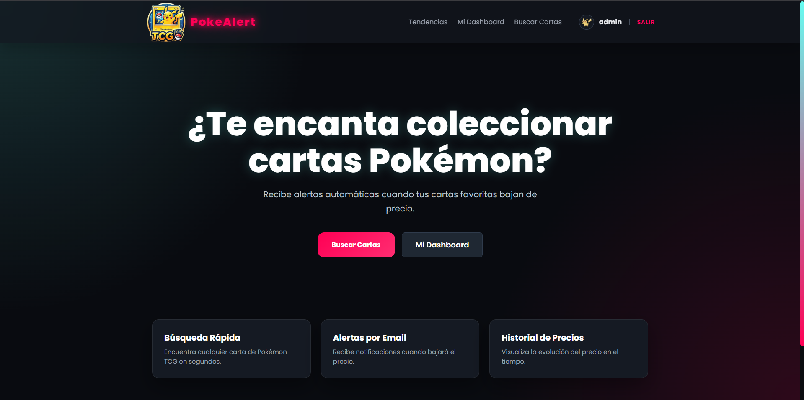
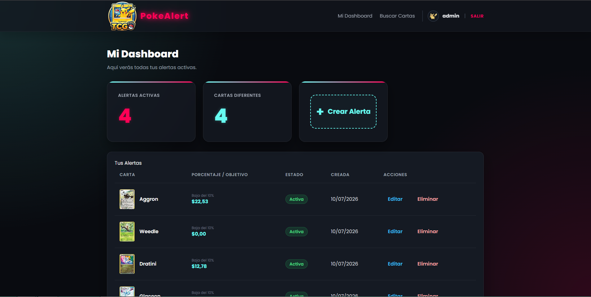
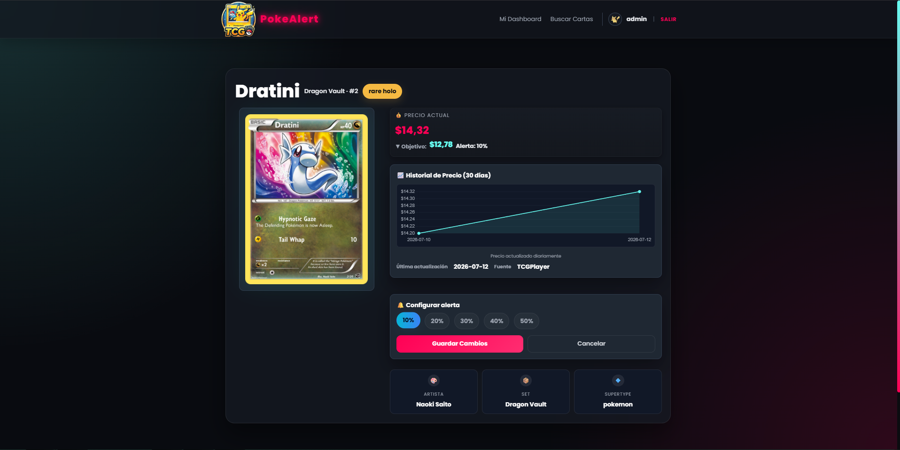
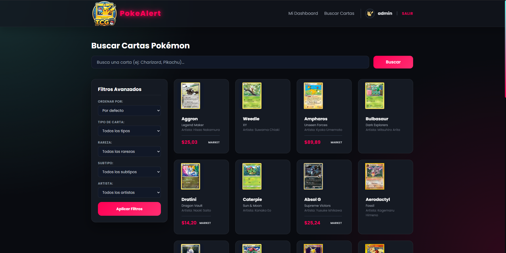
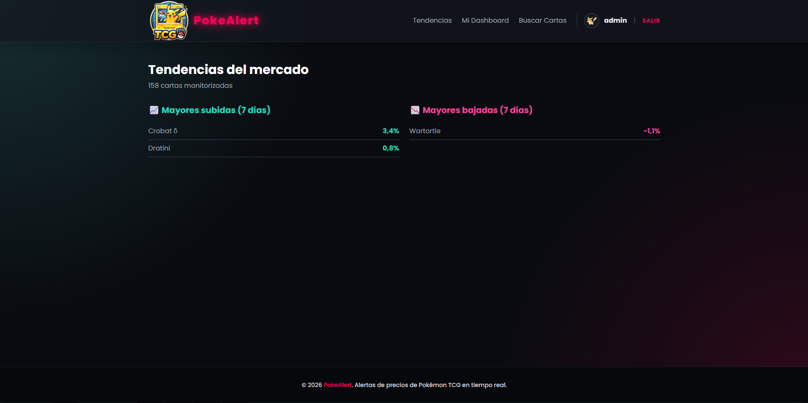

<div align="center">

# 🔔 PokéAlert

### Sistema de Alertas de Precios para Pokémon TCG

Plataforma web construida con Django para monitorizar el mercado de cartas del Pokémon Trading Card Game, con histórico de precios, alertas personalizadas y sincronización automática vía la API de Pokémon TCG.

<br>


**[🌐 Demo en vivo](https://pokealert.onrender.com)** · **[📖 Documentación](docs/PROJECT_DOCUMENTATION.md)**

</div>

---

## 📚 Tabla de Contenidos

- [Capturas](#-capturas)
- [Características](#-características)
- [Tecnologías](#-tecnologías)
- [Arquitectura](#-arquitectura)
- [Instalación](#-instalación)
- [Configuración](#-configuración)
- [Tareas Periódicas](#-tareas-periódicas)
- [API REST](#-api-rest)
- [Desarrollo y Calidad de Código](#-desarrollo-y-calidad-de-código)
- [Estructura del Proyecto](#-estructura-del-proyecto)
- [Despliegue](#-despliegue)
- [Problemas Comunes](#-problemas-comunes)
- [Roadmap](#-roadmap)
- [Contribuir](#-contribuir)
- [Autor](#-autor)
- [Licencia](#-licencia)

---

## 📸 Capturas

### Página de inicio


### Dashboard con histórico de precios


### Crear alerta de precio


### Búsqueda de cartas


### Tendencias del mercado


---

## 🌟 Características

✅ Búsqueda avanzada de cartas con filtros por rareza, tipo, artista y especie Pokémon.

✅ Autocompletado de búsqueda en español con fallback a la API oficial.

✅ Sistema de alertas configurables por descuento porcentual o precio objetivo.

✅ Histórico de precios con gráficos interactivos (Chart.js), actualizado también en producción.

✅ Ranking de tendencias de mercado: cartas con mayores subidas y bajadas de precio en los últimos 30 días.

✅ Sincronización automática con la API de Pokémon TCG, con reintentos automáticos (tenacity) ante fallos temporales.

✅ Autenticación de usuarios, incluyendo login con Google (OAuth vía django-allauth).

✅ Notificaciones por email cuando una alerta se activa.

✅ API REST documentada con OpenAPI 3.0 (drf-spectacular): Swagger UI y Redoc navegables.

✅ Tareas periódicas con Celery + Beat en local, y endpoints HTTP + cron externo en producción (ver [Tareas Periódicas](#-tareas-periódicas)).

✅ Arquitectura por capas de servicios: la lógica de negocio vive en `services/`, separada de las vistas.

✅ Suite de tests y linting automatizado (ruff, black, flake8, pydocstyle) con CI en GitHub Actions.

---

## 🚀 Tecnologías

| Tecnología | Uso |
|------------|-----|
| Python / Django | Backend y lógica de negocio |
| Django REST Framework | API REST |
| drf-spectacular | Documentación OpenAPI 3.0 (Swagger UI / Redoc) |
| PostgreSQL | Base de datos (SQLite en despliegue de demo) |
| Celery + Redis | Tareas periódicas y caché (entorno local) |
| cron-job.org | Disparo de tareas periódicas en producción |
| Chart.js | Visualización de histórico de precios |
| django-allauth | Autenticación y OAuth con Google |
| Tailwind CSS | Estilos de interfaz |
| Pokémon TCG API | Fuente de datos de cartas y precios |
| tenacity | Reintentos automáticos ante fallos de la API externa |
| GitHub Actions | Integración continua (lint + tests) |
| Render | Despliegue en producción |

---
## 🏗 Arquitectura

| Capa                                      | Responsabilidad                                                                                                                              |
| ----------------------------------------- | -------------------------------------------------------------------------------------------------------------------------------------------- |
| **Pokémon TCG API**                       | Fuente de datos de cartas y precios.                                                                                                         |
| **Sincronización**                        | Management commands para importar y actualizar cartas.                                                                                       |
| **Normalización**                         | Estandarización de Rarity, Supertype, Subtype, Artist y Species antes de guardar en la base de datos.                                        |
| **Actualización de precios (Local)**      | **Celery Beat** ejecuta `check_pokemon_prices` cada **6 horas**.                                                                             |
| **Actualización de precios (Producción)** | **cron-job.org** llama cada **24 horas** a `/api/tasks/check-prices/` (Render Free no permite tareas programadas).                           |
| **Persistencia**                          | Se almacenan los cambios en `PriceHistory` y se gestionan las `Alertas`.                                                                     |
| **API**                                   | Django REST Framework expone los endpoints consumidos por el frontend.                                                                       |
| **Frontend**                              | Interfaz desarrollada con **Tailwind CSS** y **Chart.js**, con envío de notificaciones por correo electrónico cuando se cumplen las alertas. |

El proyecto está organizado en aplicaciones Django independientes por dominio:

| App      | Responsabilidad                                 |
| -------- | ----------------------------------------------- |
| `cards`  | Catálogo de cartas, sincronización y consultas. |
| `alerts` | Alertas de precio y notificaciones.             |
| `tasks`  | Tareas programadas y procesos automáticos.      |
| `users`  | Autenticación y gestión de perfiles.            |

La lógica de negocio de `cards` y `alerts` se encuentra en una capa `services/`, separada de las vistas para facilitar el mantenimiento, las pruebas y la reutilización del código (ver [Estructura del Proyecto](#-estructura-del-proyecto)).

---

## 📦 Instalación

### 1. Clonar el repositorio

```bash
git clone https://github.com/Dangelcrack/pokealert.git
cd pokealert
```

### 2. Crear entorno virtual

```bash
# Windows
python -m venv venv
venv\Scripts\activate

# Linux / macOS
python3 -m venv venv
source venv/bin/activate
```

### 3. Instalar dependencias

```bash
pip install -r requirements.txt

# Dependencias de desarrollo (opcional)
pip install -r requirements-dev.txt
```

### 4. Configurar variables de entorno

```bash
cp .env.example .env
```

Genera una `SECRET_KEY`:

```bash
python -c "from django.core.management.utils import get_random_secret_key; print(get_random_secret_key())"
```

Genera un `CRON_SECRET_TOKEN` (protege los endpoints de disparo manual de tareas):

```bash
python -c "import secrets; print(secrets.token_urlsafe(32))"
```

### 5. Inicializar base de datos

```bash
python manage.py migrate
python manage.py populate_relations
python manage.py createsuperuser
```

### 6. Descargar datos iniciales de cartas

```bash
python manage.py descargar_cartas_json
```

### 7. Ejecutar en desarrollo

```bash
# Terminal 1: Django
python manage.py runserver

# Terminal 2: Celery Worker
celery -A config worker -l info

# Terminal 3: Celery Beat (opcional)
celery -A config beat -l info
```

Accede a: `http://localhost:8000`

---

## ⚙ Configuración

Requisitos:

- Python 3.10+
- PostgreSQL 12+
- Redis 6+
- pip

Variables de entorno principales (`.env`):

| Variable | Descripción |
|----------|--------------|
| `SECRET_KEY` | Clave secreta de Django |
| `DEBUG` | Modo debug (`True`/`False`) |
| `DATABASE_URL` | Cadena de conexión a PostgreSQL |
| `REDIS_URL` | Cadena de conexión a Redis |
| `ALLOWED_HOSTS` | Hosts permitidos |
| `EMAIL_HOST_USER` / `EMAIL_HOST_PASSWORD` | Credenciales SMTP para notificaciones |
| `POKEMON_TCG_API_KEY` | Clave de la API de Pokémon TCG |
| `GOOGLE_CLIENT_ID` / `GOOGLE_CLIENT_SECRET` | Credenciales OAuth de Google |
| `CRON_SECRET_TOKEN` | Token que protege los endpoints `/api/tasks/*` usados por el cron externo |

---

## ⏱ Tareas Periódicas

### En local: Celery + Beat

- **`check_pokemon_prices`** (cada 6h): obtiene precios actuales desde la API de Pokémon TCG, los compara con las alertas configuradas por los usuarios y envía notificaciones cuando se cumplen las condiciones.
- **`actualizar_pokedex_automatica`** (diaria): sincroniza datos de especies Pokémon y actualiza atributos TCG (rarezas, tipos, etc).

> Más detalles en [docs/CELERY.md](docs/CELERY.md).

### En producción: endpoints HTTP + cron externo

El plan gratuito de Render no permite mantener un worker ni un scheduler de Celery corriendo en segundo plano. Para resolverlo sin salir del free tier, ambas tareas están expuestas como endpoints HTTP protegidos por token que lanzan la ejecución **en segundo plano** (en un hilo) y responden de inmediato, para evitar timeouts del cronjob externo:
GET /api/tasks/check-prices/?token=<CRON_SECRET_TOKEN>
GET /api/tasks/update-pokedex/?token=<CRON_SECRET_TOKEN>

Un cronjob gratuito en **cron-job.org** llama a `check-prices` una vez al día, disparando la actualización de precios y del histórico en producción sin necesidad de Celery Worker/Beat activos. El propio código evita duplicar entradas de histórico si la tarea se ejecutara más de una vez el mismo día.

---

## 🔌 API REST

| Método | Endpoint | Descripción |
|--------|----------|-------------|
| GET | `/api/cards/` | Listar cartas (con filtros) |
| POST | `/api/cards/` | Crear carta manualmente |
| GET | `/api/cards/{id}/` | Obtener detalle de una carta |
| PUT | `/api/cards/{id}/` | Actualizar una carta |
| DELETE | `/api/cards/{id}/` | Eliminar una carta |
| GET | `/api/card/{card_id}/price-history/` | Histórico de precios de una carta (30 días) |
| POST | `/api/alerts/` | Crear una alerta de precio |
| GET | `/api/alerts/` | Listar las alertas del usuario autenticado |
| GET | `/api/alerts/{id}/` | Obtener detalle de una alerta |
| PUT | `/api/alerts/{id}/` | Actualizar una alerta |
| DELETE | `/api/alerts/{id}/` | Eliminar una alerta |
| GET | `/api/price-history/` | Listar histórico de precios (filtrable con `?card_id=`) |
| GET | `/search-suggestions/` | Autocompletado de búsqueda |
| GET | `/api/tasks/check-prices/` | Ejecutar `check_pokemon_prices` (requiere token) |
| GET | `/api/tasks/update-pokedex/` | Ejecutar `actualizar_pokedex_automatica` (requiere token) |

Documentación interactiva generada automáticamente con **drf-spectacular** (OpenAPI 3.0):

- **Swagger UI:** `http://localhost:8000/api/docs/`
- **Redoc:** `http://localhost:8000/api/redoc/`
- **Schema JSON crudo:** `http://localhost:8000/api/schema/`

---

## 🧪 Desarrollo y Calidad de Código

Antes de hacer commit:

```bash
python validate.py

# O por separado:
black cards alerts tasks users config tests
flake8 cards alerts tasks users config
pydocstyle cards alerts tasks users config
pytest
```

Tests con cobertura:

```bash
pytest --cov=cards --cov=alerts --cov=tasks --cov=users --cov-report=html
```

Todos los módulos, clases y funciones siguen el formato de docstrings de Google. Más detalles en [docs/CODE_QUALITY.md](docs/CODE_QUALITY.md).

---

## 📁 Estructura del Proyecto

```text
pokealert/
├── cards/
│   ├── models.py              # Card, Rarity, Supertype, Subtype, Artist...
│   ├── views.py
│   ├── serializers.py
│   ├── services/
│   │   ├── pokemontcg_service.py    # Cliente HTTP con reintentos (tenacity)
│   │   ├── pricing.py                # Extracción de precio de mercado
│   │   ├── pricing_trends.py         # Cálculo de variaciones de precio
│   │   ├── text_utils.py             # Normalización y expansión de búsqueda
│   │   ├── catalog_service.py        # Opciones de filtro + caché
│   │   ├── card_service.py           # Relaciones de carta y JSON local
│   │   ├── card_formatter.py         # Normalización de respuesta de la API
│   │   ├── card_detail_service.py    # Estrategia de 3 capas (caché/DB/API)
│   │   └── search_service.py         # Búsqueda combinando 3 fuentes de datos
│   └── management/
│       └── commands/
│           └── descargar_cartas_json.py

├── alerts/
│   ├── models.py              # PriceAlert, PriceHistory
│   ├── serializers.py
│   ├── services.py            # Creación/actualización de alertas
│   └── views.py

├── tasks/
│   ├── tasks.py                # check_pokemon_prices, actualizar_pokedex_automatica
│   ├── views.py                 # Endpoints HTTP (ejecución en background)
│   └── urls.py

├── users/
│   ├── models.py
│   ├── views.py
│   └── forms.py

├── config/
│   ├── settings.py
│   ├── celery.py
│   └── urls.py

├── templates/
├── static/
├── tests/
├── docs/
│   ├── screenshots/
│   ├── PROJECT_DOCUMENTATION.md
│   ├── CELERY.md
│   └── CODE_QUALITY.md

├── requirements.txt
├── requirements-dev.txt
├── pyproject.toml
├── .flake8
└── validate.py
```

## ☁ Despliegue

Desplegado en **Render** (plan gratuito) en [pokealert.onrender.com](https://pokealert.onrender.com), usando SQLite y Gunicorn.

- **Build command:** `pip install -r requirements.txt && python setup_db.py && python manage.py collectstatic --noinput`
- **Start command:** `gunicorn config.wsgi:application`

> **Nota:** el plan gratuito de Render no permite tener Celery Worker ni Beat corriendo en segundo plano, y además "duerme" el servicio tras ~15 minutos de inactividad (el primer request tras dormir puede tardar en responder). Para no perder la actualización periódica de precios en producción, las tareas se exponen como endpoints HTTP protegidos por token, ejecutadas en segundo plano para evitar timeouts, y se disparan mediante un cronjob externo gratuito (cron-job.org) una vez al día. Ver [Tareas Periódicas](#-tareas-periódicas) para el detalle. En local, todo el pipeline sigue funcionando con Celery Worker + Beat sin cambios.

---

## 🩹 Problemas Comunes

### `ModuleNotFoundError: No module named 'django'`
```bash
# Asegúrate de que el entorno virtual esté activado
# Windows: venv\Scripts\activate
# Linux/Mac: source venv/bin/activate
pip install -r requirements.txt
```

### `ConnectionError: Error -2 connecting to localhost:6379`
```bash
# Redis no está en ejecución
redis-server
# o con Docker:
docker run -d -p 6379:6379 redis:latest
```

### `ProgrammingError: relation 'cards_card' does not exist`
```bash
python manage.py migrate
python manage.py descargar_cartas_json
```

### `ModuleNotFoundError: No module named 'tasks.urls'`
```bash
# Falta el archivo tasks/urls.py, o está en la ruta incorrecta.
# Debe existir en tasks/urls.py, al mismo nivel que tasks/tasks.py y tasks/views.py
```

### Timeout en el cronjob de `check-prices` (cron-job.org)
```bash
# El plan gratuito de Render "duerme" el servicio tras inactividad.
# El endpoint ya ejecuta la tarea en un hilo en segundo plano y responde
# de inmediato, pero si el cold start de Render tarda demasiado, sube el
# timeout del cronjob en cron-job.org, o añade un segundo cronjob que
# "despierte" el servicio 1-2 minutos antes.
```

---

## 🚧 Roadmap

- [x] Autenticación con Google OAuth (django-allauth)
- [x] CI en GitHub Actions (ruff + pytest)
- [x] Refactor a arquitectura por capas de servicios
- [x] Histórico de precios con Celery Beat + Chart.js
- [x] Traducción ES→EN de nombres de cartas basada en Wikidex
- [x] Autocompletado con soporte de prefijos en español
- [x] Actualización de precios en producción sin Celery Worker/Beat (endpoints HTTP + cron-job.org)
- [x] Dashboard con métricas agregadas de mercado
- [x] Documentación de API ampliada (OpenAPI con drf-spectacular)
- [ ] Notificaciones push además de email

---

## 🤝 Contribuir

1. Crea una rama: `git checkout -b feature/nueva-funcionalidad`
2. Realiza tus cambios y añade tests
3. Ejecuta la validación: `python validate.py`
4. Commit: `git commit -am "Agrega nueva funcionalidad"`
5. Push: `git push origin feature/nueva-funcionalidad`
6. Abre un Pull Request

---

## 👨‍💻 Autor

## Ángel Guerrero

**Backend Developer**

🐙 GitHub: [github.com/Dangelcrack](https://github.com/Dangelcrack)

---

## ⭐ ¿Te resulta útil?

Si este proyecto te ha sido de ayuda, considera dejarle una **⭐ Star** en GitHub.

---

## 📄 Licencia

Distribuido bajo la licencia **MIT**. Ver [LICENSE](LICENSE) para más detalles.
